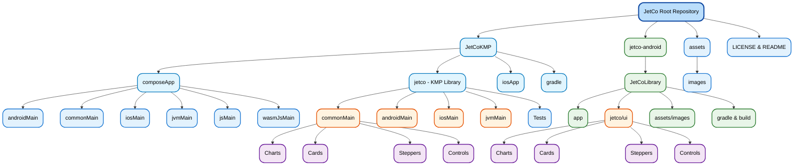

<div align="center">

# 🚀 **JetCo Library**

<p align="center">
  
  
  
</p>

<p align="center">
  <a href="https://github.com/DeveloperChunk/JetCo/releases" target="_blank" rel="noopener noreferrer">
    
  </a>
  <a href="https://central.sonatype.com/artifact/com.developerstring.jetco/ui" target="_blank" rel="noopener noreferrer">
    
  </a>
  
  
</p>

---

<h2>🎯 Your Ultimate Compose Companion</h2>

**JetCo** is a ready-to-go Compose library building awesome UI components for both **Android** and **KMP** (Kotlin Multiplatform). 💡

<p align="center">
  <strong>✨ Beautiful • ⚡ Fast • 🌍 Cross-Platform • 🎨 Customizable</strong>
</p>

Your ultimate **Open-Source** partner for crafting visually stunning, interactive, and efficient UI components across multiple platforms including **Android**, **iOS**, **JVM**, **JS**, and **WASM**. Designed specifically for Jetpack Compose enthusiasts, JetCo is here to make your life easier, your apps prettier, and your users happier. 😊

<p align="center">
  <a href="https://jetco.developerstring.com" target="_blank" rel="noopener noreferrer">
    
  </a>
  <a href="https://github.com/developerchunk/JetCo" target="_blank" rel="noopener noreferrer">
    
  </a>
</p>

</div>

> 🚧 **KMP Documentation Pipeline**: Full Kotlin Multiplatform documentation is currently in development and will be live soon! For now, **KMP projects work identically** to Android projects with the same component functionality and API. The only differences are the **Gradle implementation** and **import statements** shown below. Stay tuned! 🚀

---

<div align="center">

## �️ **Repository Structure**

Understanding the JetCo ecosystem at a glance

</div>



<div align="center">

## 🎨 **JetCo in Action**

<p><strong>✨ See the magic happen across all platforms! ✨</strong></p>

</div>

<table align="center">
  <tr>
    <td align="center">
      
      <br/><strong>🥧 Pie Chart</strong>
      <br/><sub>Interactive data visualization</sub>
    </td>
    <td align="center">
      
      <br/><strong>📊 Column Bar Chart</strong>
      <br/><sub>Beautiful data bars</sub>
    </td>
    <td align="center">
      
      <br/><strong>🔥 Extended Bar Chart</strong>
      <br/><sub>Advanced features</sub>
    </td>
    <td align="center">
      
      <br/><strong>🤓 Group Bar Chart</strong>
      <br/><sub>Multi-dataset comparison</sub>
    </td>
  </tr>
  <tr>
    <td align="center">
      
      <br/><strong>🎟️ Ticket Card</strong>
      <br/><sub>Custom card design</sub>
    </td>
    <td align="center">
      
      <br/><strong>⬇️ Vertical Stepper</strong>
      <br/><sub>Timeline progression</sub>
    </td>
    <td align="center">
      
      <br/><strong>➡️ Horizontal Stepper</strong>
      <br/><sub>Step-by-step progress</sub>
    </td>
    <td align="center">
      
      <br/><strong>🔘 Switch Button</strong>
      <br/><sub>Animated interactions</sub>
    </td>
  </tr>
  <tr>
    <td align="center">
      
      <br/><strong>📏 Compact Horizontal Stepper</strong>
      <br/><sub>Space-efficient progress</sub>
    </td>
    <td align="center">
      
      <br/><strong>🃏 Curved Card</strong>
      <br/><sub>Elegant curved corners</sub>
    </td>
    <td align="center">
      
      <br/><strong>🎨 Curved Card</strong>
      <br/><sub>Creative card layouts</sub>
    </td>
    <td align="center">
      
       <br/><strong>🔍 Animated Search Bar</strong>
      <br/><sub>Customized Animated Search Bar</sub>
    </td>
  </tr>
</table>

---

<div align="center">

## 🌍 **Platform Support**

<p><strong>Write once, run everywhere!</strong> JetCo supports all major platforms through Kotlin Multiplatform</p>

</div>

<div align="center">

| Platform | Status | Description | Target API |
|:--------:|:------:|:------------|:----------:|
|  | ✅ **Full Support** | Native Android with Jetpack Compose optimizations | API 21+ |
|  | ✅ **Full Support** | Native iOS through Compose Multiplatform | iOS 11+ |
|  | ✅ **Full Support** | Windows, macOS, Linux applications | JVM 11+ |
|  | ✅ **Full Support** | Modern web applications with Compose for Web | ES2015+ |
|  | ✅ **Full Support** | High-performance WebAssembly applications | WASM 1.0 |

</div>

<div align="center">

### 🎯 **Platform Highlights**

<table>
<tr>
<td align="center" width="200">

<br/>
<strong>Material Design 3</strong><br/>
<sub>Native performance & gestures</sub>
</td>
<td align="center" width="200">

<br/>
<strong>Native iOS Feel</strong><br/>
<sub>Cupertino design system</sub>
</td>
<td align="center" width="200">

<br/>
<strong>Cross-platform UI</strong><br/>
<sub>Windows, macOS, Linux</sub>
</td>
<td align="center" width="200">

<br/>
<strong>Modern Web Apps</strong><br/>
<sub>PWA ready, responsive</sub>
</td>
</tr>
</table>

</div>

---

<div align="center">

## 🚀 **Installation**

<p><strong>Get started in minutes!</strong> Choose your platform and follow the simple setup</p>

</div>

### 📱 **For Android - Jetpack Compose Projects**

<details open>
<summary><strong>Click to expand Android setup</strong></summary>

Add this to your module's `build.gradle.kts`:

```kotlin
dependencies {
    implementation("com.developerstring.jetco:ui:1.0.0-beta.7")
}
```

</details>

### 🌍 **For Kotlin Multiplatform Projects**

<details open>
<summary><strong>🔥 Recommended - KMP Setup (Click to expand)</strong></summary>

Add this to your `commonMain` dependencies in `build.gradle.kts`:

```kotlin
commonMain.dependencies {
    implementation("com.developerstring.jetco-kmp:ui:1.0.0-beta.8")
}
```

> ⚡ **Quick Start**: Use the same component examples below for both Android Native and Kotlin Multiplatform! All functionality is identical.

</details>

### 🛠️ **Complete KMP Setup Example**

<details>
<summary><strong>Full configuration example</strong></summary>

```kotlin
kotlin {
    // Android target
    androidTarget {
        compilations.all {
            kotlinOptions {
                jvmTarget = "1.8"
            }
        }
    }
    
    // iOS targets
    listOf(
        iosX64(),
        iosArm64(),
        iosSimulatorArm64()
    ).forEach { iosTarget ->
        iosTarget.binaries.framework {
            baseName = "ComposeApp"
            isStatic = true
        }
    }
    
    // Desktop target
    jvm("desktop")
    
    // Web target
    js(IR) {
        moduleName = "composeApp"
        browser {
            commonWebpackConfig {
                outputFileName = "composeApp.js"
            }
        }
        binaries.executable()
    }
    
    // WASM target
    wasmJs {
        moduleName = "composeApp"
        browser {
            commonWebpackConfig {
                outputFileName = "composeApp.js"
            }
        }
        binaries.executable()
    }

    sourceSets {
        commonMain.dependencies {
            implementation(compose.runtime)
            implementation(compose.foundation)
            implementation(compose.material3)
            implementation(compose.ui)
            implementation(compose.components.resources)
            
            // 🎨 Add JetCo KMP
            implementation("com.developerstring.jetco-kmp:ui:1.0.0-beta.8")
        }
        
        androidMain.dependencies {
            implementation(libs.compose.ui.tooling.preview)
            implementation(libs.androidx.activity.compose)
        }
        
        iosMain.dependencies {
            // iOS specific dependencies
        }
        
        desktopMain.dependencies {
            implementation(compose.desktop.currentOs)
        }
    }
}
```

</details>

---

<div align="center">

## 📊 **UI Components Gallery**

<p><strong>🎨 Rich, customizable components for every need</strong></p>

</div>

<div align="center">

### 📈 **Charts & Data Visualization**

| Component | Description | Platforms | Status |
|:----------|:------------|:---------:|:------:|
| **🥧 Pie Chart** | Interactive pie charts with customizable slices and animations |  | ✅ |
| **📊 Column Bar Chart** | Beautiful vertical bar charts with smooth transitions |  | ✅ |
| **🔥 Extended Bar Chart** | Advanced bar charts with multiple datasets and styling |  | ✅ |
| **🤓 Group Bar Chart** | Side-by-side comparison charts for multi-series data |  | ✅ |

### 🎴 **Cards & Layout**

| Component | Description | Platforms | Status |
|:----------|:------------|:---------:|:------:|
| **🎟️ Ticket Card** | Cinema-style cards with cutout design and dashed dividers |  | ✅ |

### 🔄 **Navigation & Progress**

| Component | Description | Platforms | Status |
|:----------|:------------|:---------:|:------:|
| **⬇️ Vertical Stepper** | Timeline-style stepper with images and descriptions |  | ✅ |
| **➡️ Horizontal Stepper** | Clean horizontal progress indicator |  | ✅ |
| **⚡ Compact Stepper** | Minimal icon-only stepper for mobile interfaces |  | ✅ |

### 🎛️ **Interactive Controls**

| Component | Description | Platforms | Status |
|:----------|:------------|:---------:|:------:|
| **🔘 Switch Button** | Animated toggle switch with custom styling |  | ✅ |

</div>


> 🚧 **Coming Soon:** Date Pickers, Floating Action Buttons, Bottom Sheets, and more!
  
---

<div align="center">

## 🚀 **Getting Started**

<p><strong>⚡ From zero to awesome in 5 minutes!</strong></p>

</div>

### 🎯 **Quick Start**

### 📦 **Import Components**

<details open>
<summary><strong>📝 Import statements for different setups</strong></summary>

```kotlin
// 🌍 For KMP projects (Recommended)
import com.developerstring.jetco_kmp.charts.piechart.PieChart
import com.developerstring.jetco_kmp.cards.ticket.TicketCard
import com.developerstring.jetco_kmp.cards.curved.CurvedCard
import com.developerstring.jetco_kmp.components.stepper.VerticalStepper
import com.developerstring.jetco_kmp.components.button.SwitchButton
import com.developerstring.jetco_kmp.components.search.animated_searchbar.AnimatedSearchBar


// 🤖 For Android-only projects  
import com.developerstring.jetco.ui.charts.piechart.PieChart
import com.developerstring.jetco.ui.cards.ticket.TicketCard
import com.developerstring.jetco.ui.cards.curved.CurvedCard
import com.developerstring.jetco.ui.components.stepper.VerticalStepper
import com.developerstring.jetco.ui.components.button.SwitchButton
import com.developerstring.jetco.ui.components.search.animated_searchbar.AnimatedSearchBar
```

> 💡 **Note**: All components have **identical functionality and API** across both Android and KMP versions. Only the import path and Gradle dependency differ!

</details>

### 🎨 **Few Quick Examples**

<details>
<summary><strong>Pie Chart</strong></summary>

```kotlin
@Composable
fun MyAwesomeScreen() {
    // 🎨 Use any JetCo component across all platforms!
    PieChart(
        data = listOf(
            PieChartData(
                label = "Android", 
                value = 40f, 
                color = Color(0xFF3DDC84)
            ),
            PieChartData(
                label = "iOS", 
                value = 30f, 
                color = Color(0xFF007AFF)
            ), 
            PieChartData(
                label = "Web", 
                value = 20f, 
                color = Color(0xFFFF6B35)
            ),
            PieChartData(
                label = "Desktop", 
                value = 10f, 
                color = Color(0xFFFFD23F)
            )
        ),
        modifier = Modifier
            .size(300.dp)
            .padding(16.dp),
        animationDuration = 1000,
        showLabels = true,
        centerText = "JetCo"
    )
}
```

</details>

<details>
<summary><strong>Ticket Card</strong></summary>

```kotlin
@Composable
fun TicketExample() {
    TicketCard(
        modifier = Modifier
            .fillMaxWidth()
            .padding(16.dp),
        backgroundColor = Color(0xFF6200EE),
        cornerRadius = 16.dp,
        cutoutRadius = 24.dp
    ) {
        Column(
            modifier = Modifier.padding(20.dp),
            horizontalAlignment = Alignment.CenterHorizontally
        ) {
            Text(
                text = "🎬 Movie Ticket",
                style = MaterialTheme.typography.headlineSmall,
                color = Color.White
            )
            Spacer(modifier = Modifier.height(8.dp))
            Text(
                text = "JetCo: The Movie",
                style = MaterialTheme.typography.bodyLarge,
                color = Color.White.copy(alpha = 0.8f)
            )
        }
    }
}
```

</details>

<details>
<summary><strong>Curved Card</strong></summary>

```kotlin
@Composable
fun CurvedCardExample() {
    CurvedCard(
        modifier = Modifier
            .fillMaxWidth()
            .padding(16.dp),
        backgroundColor = Color(0xFF673AB7),
        cornerRadius = 20.dp,
        curveHeight = 40.dp,
        curvePosition = CurvePosition.TOP_CENTER,
        shadowElevation = 8.dp
    ) {
        Column(
            modifier = Modifier.padding(24.dp),
            horizontalAlignment = Alignment.CenterHorizontally
        ) {
            Icon(
                imageVector = Icons.Default.Star,
                contentDescription = "Premium",
                tint = Color(0xFFFFD700),
                modifier = Modifier.size(48.dp)
            )
            Spacer(modifier = Modifier.height(16.dp))
            Text(
                text = "Premium Membership",
                style = MaterialTheme.typography.headlineSmall,
                color = Color.White,
                textAlign = TextAlign.Center
            )
            Spacer(modifier = Modifier.height(8.dp))
            Text(
                text = "Unlock exclusive features with our curved card design",
                style = MaterialTheme.typography.bodyMedium,
                color = Color.White.copy(alpha = 0.9f),
                textAlign = TextAlign.Center
            )
        }
    }
}
```

</details>

<details>
<summary><strong>Animated Switch Button</strong></summary>

```kotlin
@Composable
fun SwitchExample() {
    var isChecked by remember { mutableStateOf(false) }
    
    SwitchButton(
        checked = isChecked,
        onCheckedChange = { isChecked = it },
        modifier = Modifier.padding(16.dp),
        colors = SwitchButtonColors(
            checkedColor = Color(0xFF4CAF50),
            uncheckedColor = Color(0xFFE0E0E0),
            thumbColor = Color.White
        ),
        animationDuration = 300
    )
}
```

</details>

<details>
<summary><strong>Animated Search Bar</strong></summary>

```kotlin
@Composable
fun AnimatedSearchBarPreview() {
  val query by remember { mutableStateOf("") }
  val controller = rememberAnimatedSearchBarController()
  var isLoading by remember { mutableStateOf(false) } //to show loading animation when result are being searched

  AnimatedSearchBar(
        value = query,
        onValueChange = { query = it },
        controller = controller,
        isLoading = isLoading, 
        onSearch = { text ->
            // trigger real search
        },
        config = AnimatedSearchBarConfig(
            collapsedWidth = 56.dp,
            expandedWidth = 300.dp,
            height = 48.dp,
            barBackgroundColor = Color.White,
            barCornerRadius = 32.dp
        ),
        animationConfig = AnimatedSearchBarAnimationConfig(
            widthSpringStiffness = Spring.StiffnessLow,
            widthSpringDamping = Spring.DampingRatioMediumBouncy
        )
    )
}
```

</details>

<div align="center">

### 📚 **Learn More**

<a href="https://jetco.developerstring.com" target="_blank" rel="noopener noreferrer">
  
</a>
<a href="https://jetco.developerstring.com/examples" target="_blank" rel="noopener noreferrer">
  
</a>
<a href="https://jetco.developerstring.com/api" target="_blank" rel="noopener noreferrer">
  
</a>

> 🔥 **Coming Soon**: Dedicated KMP documentation with platform-specific examples and deployment guides!

</div>

---

---

<div align="center">

## � **Why Choose JetCo?**

<p><strong>🚀 The ultimate developer experience</strong></p>

</div>

<table align="center">
<tr>
<td align="center" width="200">

<br/>
<strong>Write Once, Run Everywhere</strong>
<br/>
<sub>Single codebase for Android, iOS, Web, Desktop & WASM</sub>
</td>
<td align="center" width="200">

<br/>
<strong>Blazing Performance</strong>
<br/>
<sub>Optimized for smooth 60fps animations</sub>
</td>
<td align="center" width="200">

<br/>
<strong>Stunning Components</strong>
<br/>
<sub>Pixel-perfect design with Material 3</sub>
</td>
</tr>
<tr>
<td align="center">

<br/>
<strong>Zero Learning Curve</strong>
<br/>
<sub>Intuitive API, comprehensive docs</sub>
</td>
<td align="center">

<br/>
<strong>Highly Flexible</strong>
<br/>
<sub>Theme every component to match your brand</sub>
</td>
<td align="center">

<br/>
<strong>Always Updated</strong>
<br/>
<sub>Regular updates with latest Compose features</sub>
</td>
</tr>
</table>

<div align="center">

### 🎯 **Perfect For**

    

</div>

---

<div align="center">

## 🚀 **What Makes JetCo Special?**

<p><strong>✨ The features that set us apart</strong></p>

</div>

<div align="center">

| Feature | Description | Benefit |
|:--------|:------------|:--------|
| 🌐 **Kotlin Multiplatform** | One codebase for Android, iOS, Web, Desktop, and WASM | **50% less development time** |
| 🖌️ **Modern UI Components** | Charts, cards, steppers with beautiful animations | **Professional look out-of-the-box** |
| ⚡ **Compose Integration** | Seamless with Jetpack Compose and Compose Multiplatform | **Native performance everywhere** |
| 🛠️ **Infinite Customization** | Theme every pixel to match your brand identity | **Unique, branded experiences** |
| 🚀 **Performance Optimized** | Lightweight, efficient, 60fps smooth animations | **Happy users, better retention** |
| 📱 **Platform-Specific** | Tailored experiences respecting platform conventions | **Feels native on every platform** |
| 🔄 **Future-Ready** | Built for the next generation of Compose | **Investment protection** |
| 🆓 **Open Source** | MIT licensed, community-driven development | **Free forever, transparent** |

</div>

---

<div align="center">

## 🤝 **Join the JetCo Community**

<p><strong>🌟 Be part of something amazing!</strong></p>

<a href="https://github.com/developerchunk/JetCo/stargazers">
  
</a>
<a href="https://github.com/developerchunk/JetCo/fork">
  
</a>
<a href="https://github.com/developerchunk/JetCo/issues">
  
</a>
<a href="https://github.com/developerchunk/JetCo/discussions">
  
</a>

<br/><br/>

### 🎉 **Contributors Welcome!**

We're always looking for passionate developers to join our mission of making beautiful UI accessible to everyone.

Check out our [Contributing Guide](https://jetco.developerstring.com/community) and [Good First Issues](https://github.com/developerchunk/JetCo/labels/good%20first%20issue)!

</div>

---

<div align="center">

### 💝 **Show Some Love**

<p>If JetCo helped you build something amazing, consider:</p>

<a href="https://github.com/developerchunk/JetCo">⭐ Starring the repo</a> • 
<a href="https://twitter.com/intent/tweet?text=Check%20out%20JetCo%20-%20Beautiful%20Compose%20UI%20components%20for%20multiplatform!&url=https://github.com/developerchunk/JetCo">🐦 Sharing on Twitter</a> • 
<a href="https://www.linkedin.com/sharing/share-offsite/?url=https://github.com/developerchunk/JetCo">💼 Sharing on LinkedIn</a>

<p><sub>Made with ❤️ by the JetCo team</sub></p>


</div>


